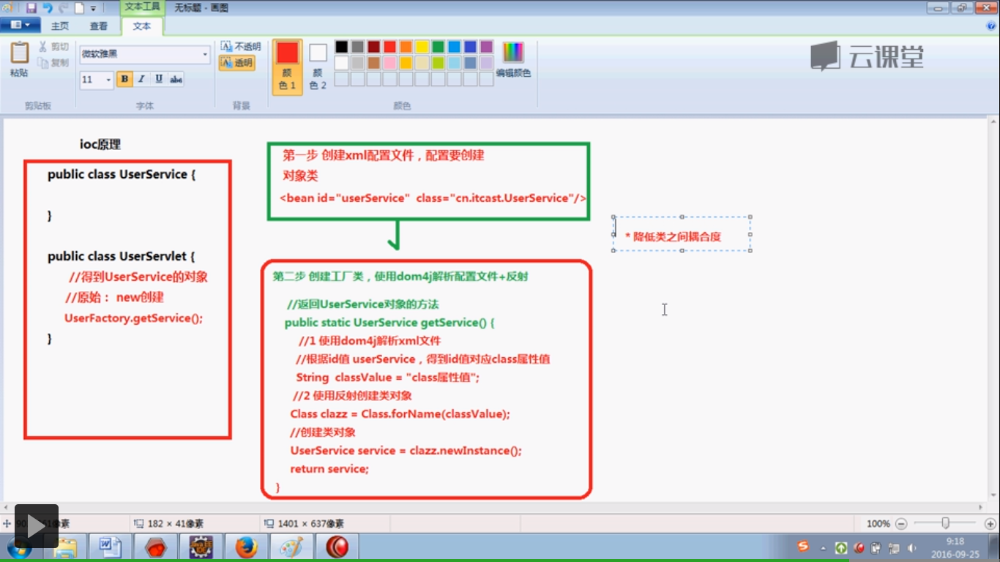
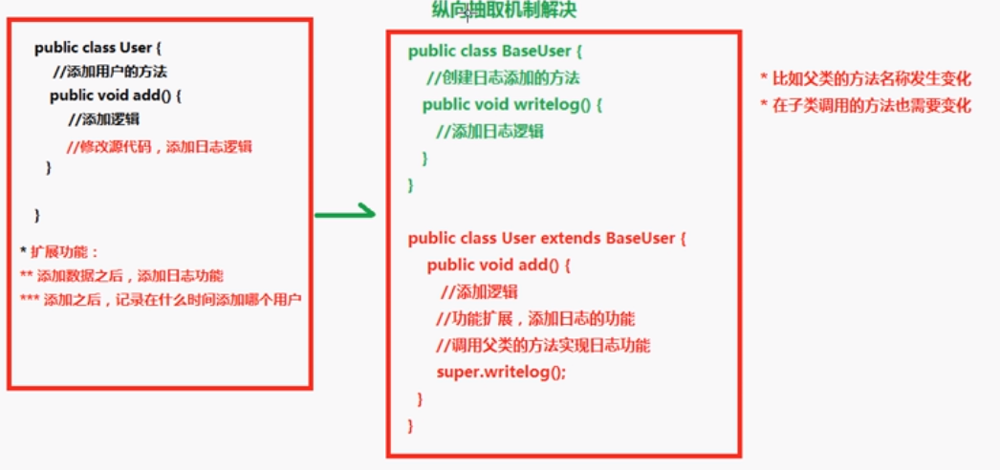
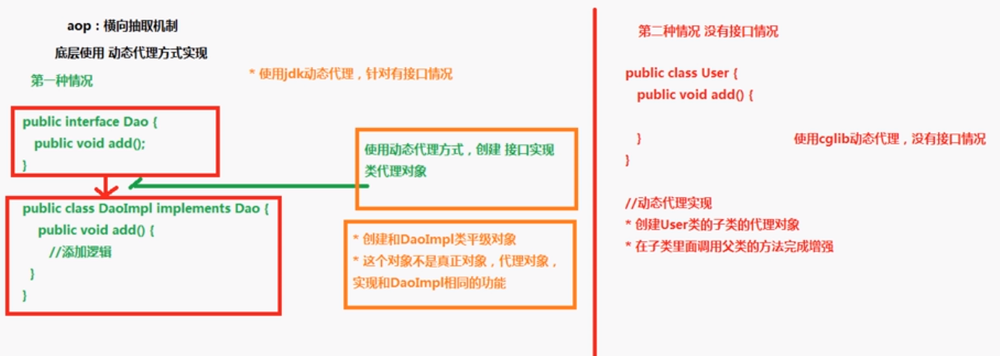

### sping 学习总结：
- www.manning.com/SpringinActionFourthEdition

- https://www.eclipse.org/downloads/eclipse-packages/?osType=linux

- https://www.cnblogs.com/tangshengwei/p/6341462.html
- https://blog.csdn.net/java_2017_csdn/article/details/77450598/

- https://www.cnblogs.com/xiongxx/p/6057558.html

##### [spring IOC 底层原理](https://study.163.com/course/courseLearn.htm?courseId=1004475015#/learn/video?lessonId=1048865301&courseId=1004475015)
  - XML 
  - dom4j 解析XML
  - 工厂设计模式
  - 反射


##### spring AOP 原理
###### 概念：面向切面增强，扩展功能不通过修改代码实现；横向取代面向继承体系编程。
###### 原理分析
   - 1. JDK 动态代理（有接口）：java动态代理是利用反射机制生成一个实现代理接口的匿名类，在调用具体方法前调用InvokeHandler来处理。
   - 2. CGLib(没有接口)：CGlib动态代理是利用asm开源包，对代理对象类的class文件加载进来，通过修改其字节码生成子类来处理。

###### 区别
   - 1、如果目标对象实现了接口，默认情况下会采用JDK的动态代理实现AOP 
   - 2、如果目标对象实现了接口，可以强制使用CGLIB实现AOP 
   - 3、如果目标对象没有实现了接口，必须采用CGLIB库，spring会自动在JDK动态代理和CGLIB之间转换





### 官方文档：
- https://spring.io/guides
- http://projects.spring.io/spring-framework/#quick-start

```
curl https://start.spring.io/starter.tgz -d dependencies=web,actuator \
> -d language=java -d javaVersion=1.8 -d type=gradle-project -d baseDir=spring.io | tar -xzvf -
```

#### spting 实战源码运用：
```
gradle task
gradle eclipse
```

### ActiveMQ 使用
```
https://www.cnblogs.com/jaycekon/p/6225058.html
./bin/activemq start
port: 8161
```

### rabbitmq 安装：http://www.rabbitmq.com/install-debian.html
```
wget -O- https://www.rabbitmq.com/rabbitmq-release-signing-key.asc | sudo apt-key add -
sudo apt-get update
sudo apt-get install rabbitmq-server
```
- 参考文档：https://www.cnblogs.com/luxiaoxun/p/3918054.html
